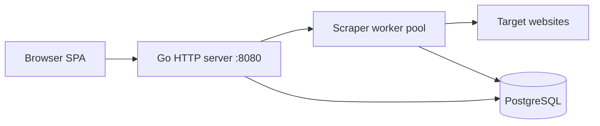

# Web Scraper

A full-stack web scraper written in Go. It fetches pages concurrently, stores raw HTML in PostgreSQL, and exposes a small web UI to start bulk jobs and browse past scrapes.

## Features

- **Concurrent scraping** — worker pool limits parallel HTTP requests (default: 5 workers, 10s timeout per request)
- **Bulk jobs** — upload a `.txt` file of URLs or use the sample list in `urls.txt`
- **Paginated fetching** — “max depth” controls how many `?page=N` variants are requested per seed URL
- **PostgreSQL storage** — raw HTML stored in `raw_html`; schema migrations run on startup
- **Web UI** — drag-and-drop URL lists, scrape history sidebar, filters, and basic stats
- **Graceful shutdown** — SIGINT/SIGTERM cancels in-flight scrapes and shuts down the HTTP server cleanly

## Tech stack

| Layer      | Stack                                      |
|------------|--------------------------------------------|
| Backend    | Go 1.25, `net/http`, `database/sql`        |
| Database   | PostgreSQL (`github.com/lib/pq`)           |
| HTML parse | goquery (link extraction in depth scraper) |
| Frontend   | Vanilla TypeScript → `app.js`, static CSS  |

## Architecture



On startup, the server connects to Postgres, runs migrations, serves the frontend from `./frontend`, and registers API routes.

## Prerequisites

- [Go](https://go.dev/dl/) 1.25+
- [PostgreSQL](https://www.postgresql.org/) 14+ (local or remote)
- Optional: [Node.js](https://nodejs.org/) — only if you edit `frontend/app.ts`

## Setup

### 1. Database

Create a database and user:

```sql
CREATE USER webscraper WITH PASSWORD 'your_password';
CREATE DATABASE webscraper OWNER webscraper;
```

### 2. Environment variables

Create a `.env` file in the project root (see `.gitignore` — it is not committed):

```env
DB_HOST=localhost
DB_PORT=5432
DB_USER=webscraper
DB_PASSWORD=your_password
DB_NAME=webscraper
```

### 3. Install Go dependencies

```bash
go mod download
```

### 4. Frontend (optional)

The repo ships with compiled `frontend/app.js`. Rebuild only after changing TypeScript:

```bash
cd frontend
npm install
npm run build
```

## Run

From the project root:

```bash
go run .
```

Open [http://localhost:8080](http://localhost:8080). The server listens on `:8080`.

## Usage

### Web UI

1. **New scrape** — drop or select a `.txt` file with one URL per line (must start with `http`).
2. Set **max depth** (1–10): number of paginated pages fetched per URL (`?page=1`, `?page=2`, …).
3. Click **Start scraping** — jobs run in the background; check **Previous scrapes** in the sidebar when they finish.

Example URL file: `urls.txt` or `frontend/example-urls.txt`.

### API

| Method | Path | Description |
|--------|------|-------------|
| `GET` | `/health` | DB ping; returns `OK` or 503 |
| `GET` | `/api/scrapes` | JSON list of completed scrapes |
| `POST` | `/api/scrape/bulk` | Start a bulk scrape |
| `GET` | `/query` | Filter stored rows (plain-text response today) |

**Bulk scrape** — `POST /api/scrape/bulk`

```json
{
  "urls": ["https://example.com"],
  "depth": 3,
  "keyword": "price"
}
```

- `depth` — max pages per URL (default 3 if out of range)
- `keyword` — accepted by the API; parsing/filtering integration is still evolving

**Query** — `GET /query`

| Parameter | Description |
|-----------|-------------|
| `link` | Repeatable; match URL substring in HTML |
| `keyword` | Repeatable; match keyword in HTML |
| `from`, `to` | Date range on `completed_at` |
| `sort` | `date` or `size` |
| `limit` | Max rows (default 10) |

## Project layout

```
webScraper/
├── main.go              # Entry point, DB init, server lifecycle
├── handler/             # HTTP routes and handlers
├── scraper/             # Fetch logic, concurrency, depth crawler
├── database/            # Postgres init, migrations, query builder
├── parser/              # HTML keyword / title helpers
├── scanner/             # Read URL lists from files
└── frontend/            # SPA (index.html, app.ts, styles.css)
```


